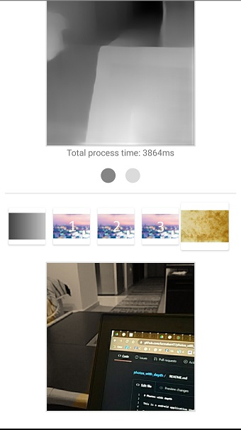

# Photos with depth

This is a android application that uses ML model to estimate depth in photos and produces a bokeh effect.

The model is taken from [this](https://syncedreview.com/2020/04/13/ai-transforms-rgb-d-images-into-an-impressive-3d-format/) paper and it is a CNN-based single depth estimation model. CNN-based methods have recently demonstrated promising results on estimating depth from a single image. Due to the difficulty of collecting labeled datasets, earlier approaches often focus on specific visual domains such as indoor scenes or street view. While the accuracy of these approaches is not yet competitive with multi-view stereo algorithms, that line of research and the output model is particularly promising due to the availability of larger and more diverse training datasets from relative depth annotations, multi-view stereo, 3D movies and synthetic data. For cases where only one single color image is available, they have obtained the depth estimation through a pre-trained depth estimation model. Removing the dependency on stereo or multiple images as input has made their method more widely applicable to all the existing photos.

The model that we used was written in __Pytorch__. With the provided colab notebook at the master branch you can follow along and see the conversion to ONNX, TensorFlow and finally to TensorFlow Lite to obtain the model that was finally used inside the android application. Inside the notebook you can observe all the pre and post-process of the images so an array will be available to be used with the TensorFlow Lite Interpreter. Pytorch models expect [1, 3, Width, Height] format of the inputs and so does the final TensorFlow Lite model. Due to that, usage of an array as input is mandatory and TensorFow Lite Support or TensorFow Lite Metadata libraries were not used in this project.

The output of the model is an array of [1, 1, Width, Height] shape. This array is converted to a grayscale image and then on screen you can observe the input image and a grayscale one with the depth estimation in various tones of gray. Selecting specific values of pixels above a certain number we focus on the objects inside the image that are closer to the camera. That objects remain unchanged and the background is converted to B/W, blurred or sepia. Below you can see some mobile selfie screenshots:

  

and screenshots when the background camera is used inside a room:

  

## Explore the code

We're now going to walk through the most important parts of the sample code.

This application uses CameraX to get an image from the front or back camera. You can see the implementation inside [`CameraFragment.kt`](https://github.com/farmaker47/photos_with_depth/blob/master/app/src/main/java/com/soloupis/sample/photos_with_depth/fragments/CameraFragment.kt) class. You can also load an image from the phone's gallery.

The [`ImageUtils.kt`](https://github.com/farmaker47/photos_with_depth/blob/master/app/src/main/java/com/soloupis/sample/photos_with_depth/utils/ImageUtils.kt) class contains the basic code for pre-processing the image and create the float array of size [1, 3, Width, Height] that is going to be used from the interpreter.

```
fun bitmapToFloatArray(bitmap: Bitmap):
                Array<Array<Array<FloatArray>>> {
            val width: Int = bitmap.width
            val height: Int = bitmap.height
            val intValues = IntArray(width * height)
            bitmap.getPixels(intValues, 0, width, 0, 0, width, height)

            val floatArray = Array(1) {
                Array(3) {
                    Array(width) {
                        FloatArray(height)
                    }
                }
            }

            for (i in 0 until width - 1) {
                for (j in 0 until height - 1) {
                    val pixelValue: Int = intValues[i * width + j]
                    floatArray[0][0][i][j] =
                        Color.red(pixelValue) / 255.0f // or  (pixelValue shr 16 and 0xff).toFloat() / 255.0f
                    floatArray[0][1][i][j] =
                        Color.green(pixelValue) / 255.0f // or (pixelValue shr 8 and 0xff).toFloat() / 255.0f
                    floatArray[0][2][i][j] =
                        Color.blue(pixelValue) / 255.0f // or (pixelValue and 0xff).toFloat() / 255.0f
                }

            }

            return floatArray
}
```

then inside [`DepthAndStyleModelExecutor.kt`](https://github.com/farmaker47/photos_with_depth/blob/master/app/src/main/java/com/soloupis/sample/photos_with_depth/fragments/segmentation/DepthAndStyleModelExecutor.kt) class 
interpreter uses the above float array and gives the result which is also a float array of shape [1, 1, Width, Height].


